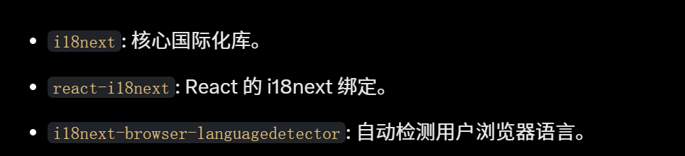
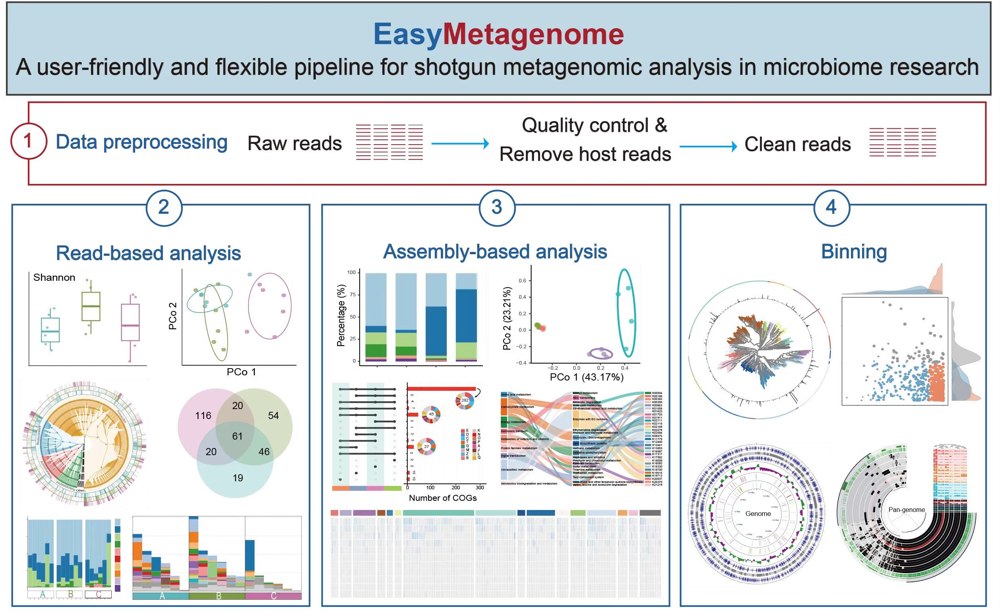
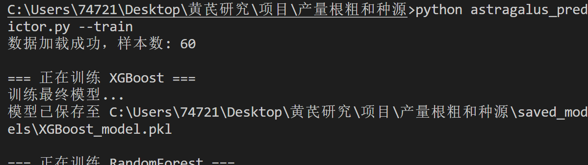
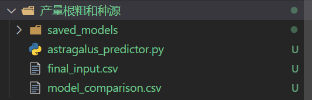
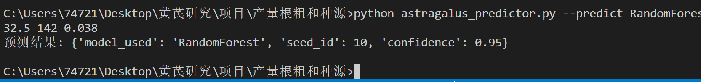

<h1 align = "center">药植智境模型开发者文档</h1>

# 本项目前端：React+Vite,后端接口:Python

# 目录

- [依赖安装](#依赖安装)
- 模型训练
  - [根长+产量预测种类](#根长root_length产量yield等预测种源source_id模型是怎么来的)
  - [气候 bio 预测种类]

# 依赖安装

```sh
npm install i18next react-i18next i18next-browser-languagedetector
```



# 做类似流程图



# `根长(root_length)+产量(yield)`等预测`种源(Source_id)`模型是怎么来的

## [训练脚本](../产量根粗和种源/astragalus_predictor.py)

## [训练源文件](../产量根粗和种源/final_input.csv)

## `训练`指令,这样会生成对应的模型文件和输出结果(R 方和特征影响百分比)

```py
python astragalus_predictor.py --train
```

## `运行`后的结果




## `测试`接口,

```py
# 使用RandomForest预测
python astragalus_predictor.py --predict RandomForest 32.5 142 0.038
```

## 结果一目了然



# 
